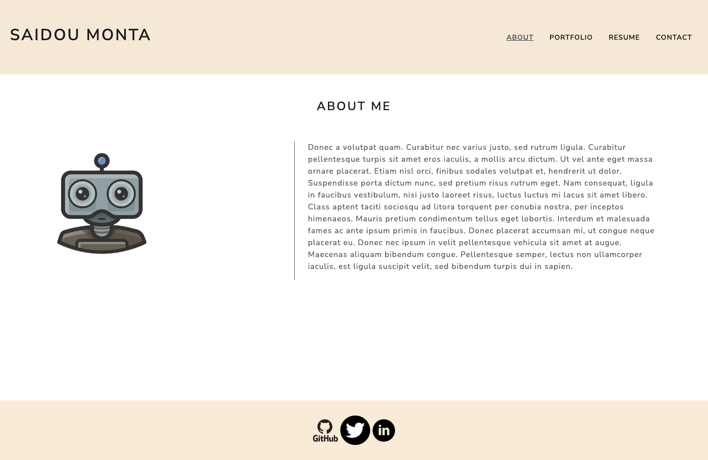
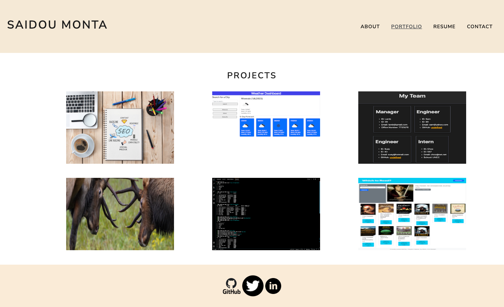

# [Reac-Portfolio](https://saidou25.github.io/React-Portfolio/)
---
[Link to repository](https://github.com/Saidou25/React-Portfolio.git)

[](https://opensource.org/licenses/MIT)

## Description

This is an application showing my rsume and few of my projects for potential employers to view.

## Table of Contents

* [Installation](#installation)
* [Technologies](#technologies)
* [Visuals](#visuals)
* [License](#license)
* [Tests](#tests)
* [Questions](#questions)

## Installation

```npm start``` open the app in the browser and keeps it updated with current changes.

## Technologies

```bootstrap```

```bootswatch ```

```react"```

```webpack```

## Visuals

Here is a visual of the landing page:



This page shows few of my Projects:




## License

This project is licensed under the MIT. 
For license notice, please click on the license badge at the top of this readme file or here: [](https://opensource.org/licenses/MIT)


## Tests

N/A

## Questions

If you have any questions comments or concerns please reach [Sy25](https://github.com/Saidou25/React-Portfolio).

